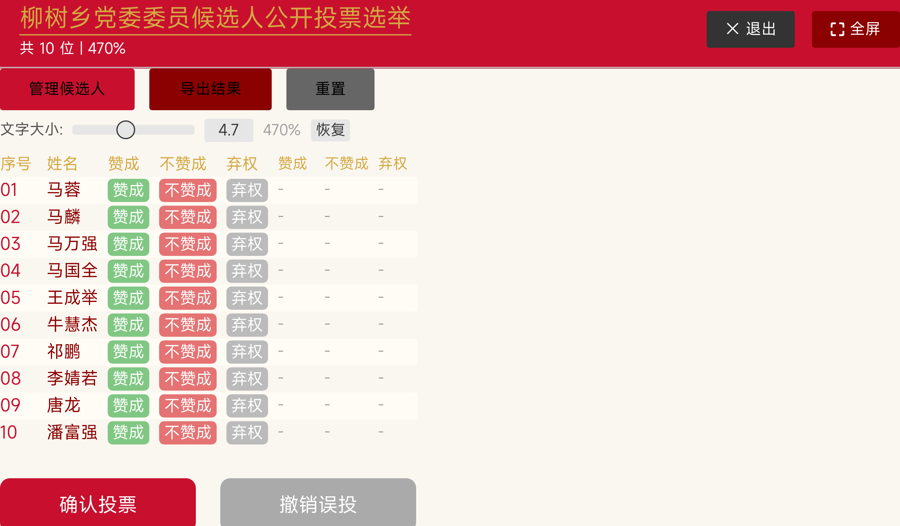
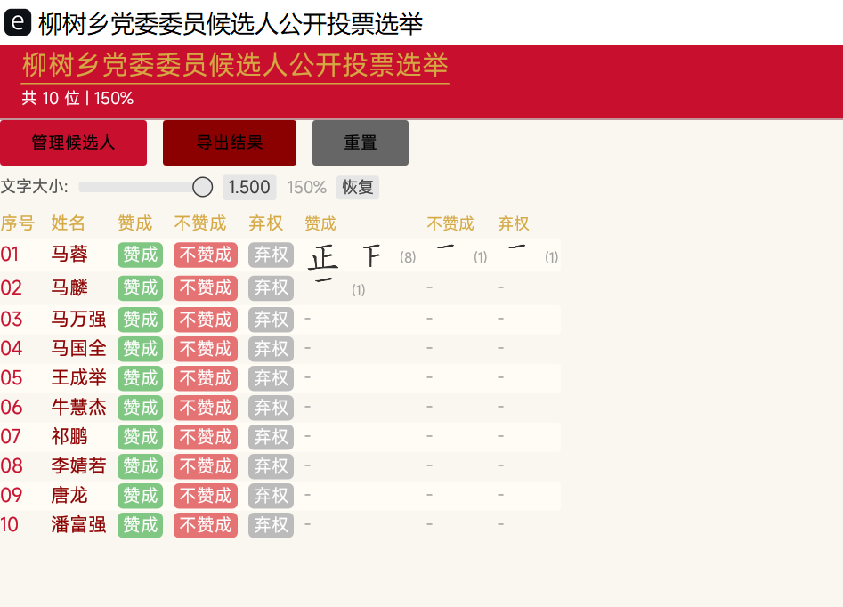
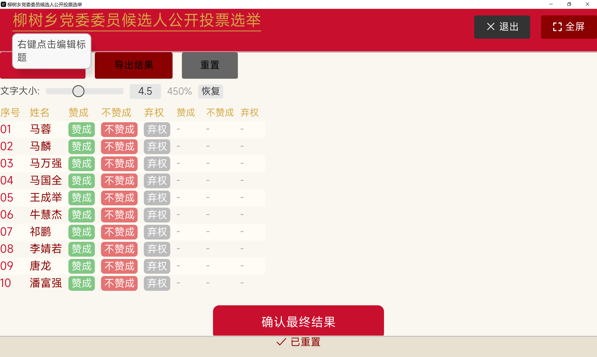
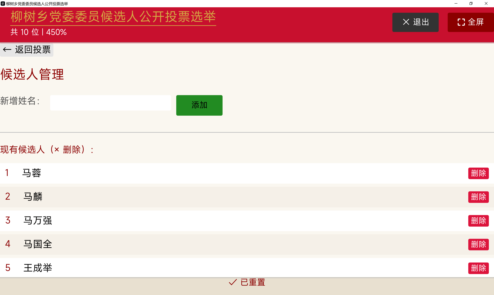

# 柳树乡党委委员候选人公开投票选举软件

基于 Rust + egui 开发的桌面投票选举工具，采用经典「画正字」方式计票。

## 功能特性

- **画正字计票**：SVG 矢量渲染，高清无锯齿，按笔顺逐画显示
- **政务风格界面**：中国红 + 金色配色，庄重正式
- **Windows DPI 自适应**：自动读取系统显示缩放率
- **字号无级调节**：滑块范围 0.75~10.0，默认 1.25
- **选举标题可编辑**：右键标题栏随时修改，自动保存到 `data/title.csv`
- **候选人管理**：应用内增删改，同步到 `data/candidates.csv`
- **撤销误投**：提交后可一键撤销，恢复上一轮数据
- **结果导出**：一键导出到 `data/投票结果.txt`
- **全屏显示**：F11 或按钮切换，适合大屏展示
- **数据持久化**：所有数据自动保存到 `data/votes.json`

## 界面预览

### 投票主页（默认状态）


### 投票主页（画正字效果）


### 右键编辑标题


### 管理候选人


## 使用说明

### 投票流程
1. 为每位候选人点击「赞成」「不赞成」「弃权」按钮（暂存选择）
2. 选择时按钮变深色，未选择时行背景为淡黄色
3. 全部选完后点击「确认投票」→ 画正字实时更新
4. 误操作可点击「撤销误投」恢复上一轮

### 编辑标题
- 右键点击标题栏 → 输入新标题 → 点击「保存」
- 标题同步保存到 `data/title.csv`

### 管理候选人
- 点击「管理候选人」→ 输入姓名点击「添加」或点击「删除」
- 候选人同步保存到 `data/candidates.csv`

### 导出结果
- 点击「导出结果」→ 文件保存在 `data/投票结果.txt`

## 项目结构

```
Public-Voting-System/
├── Cargo.toml              # 项目配置
├── build.rs                # 构建脚本
├── README.md               # 本文件
├── resources/
│   ├── font/MiSans-Normal.ttf    # 中文字体
│   └── img/                      # 正字笔画 SVG 路径（代码内嵌）
├── src/
│   ├── main.rs             # 入口（Windows DPI 读取）
│   ├── models.rs           # 数据模型（Candidate/VoteChoice）
│   ├── storage.rs          # 持久化（CSV/JSON/TXT）
│   ├── tally.rs            # 画正字 SVG 渲染
│   ├── display.rs          # 界面文字配置
│   ├── ui.rs               # UI 渲染
│   └── util.rs             # 工具函数
└── data/                   # 运行时数据目录
    ├── candidates.csv      # 候选人名单
    ├── title.csv           # 选举标题
    ├── votes.json          # 投票数据
    └── 投票结果.txt         # 导出结果
```

## 数据文件格式

### candidates.csv
```
马蓉
马麟
马万强
...
```

### title.csv
```
柳树乡党委委员候选人公开投票选举
```

### votes.json
```json
{
  "candidates": [
    { "id": 1, "name": "马蓉", "approve": 5, "oppose": 2, "abstain": 1 },
    ...
  ]
}
```

## 构建运行

### 环境要求
- Rust 1.75+
- Windows 10/11

### 开发模式
```bash
cargo run
```

### 发布模式（推荐）
```bash
cargo build --release
# 可执行文件位于 target/release/voting_app.exe
```

### 独立部署
将以下文件/目录复制到 `voting_app.exe` 同级目录：
```
voting_app.exe
data/
```

## 技术栈

| 组件 | 用途 |
|------|------|
| egui 0.28 | 即时模式 GUI 框架 |
| eframe 0.28 | 原生窗口后端 |
| resvg 0.41 | SVG 矢量渲染 |
| serde/serde_json | JSON 序列化 |
| toml | 配置文件解析 |

## License

内部使用
